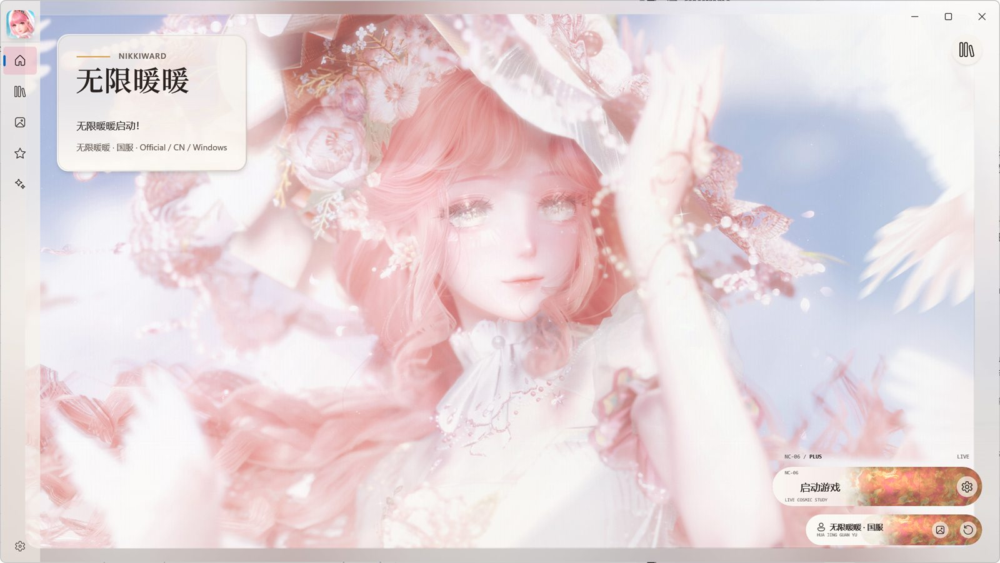
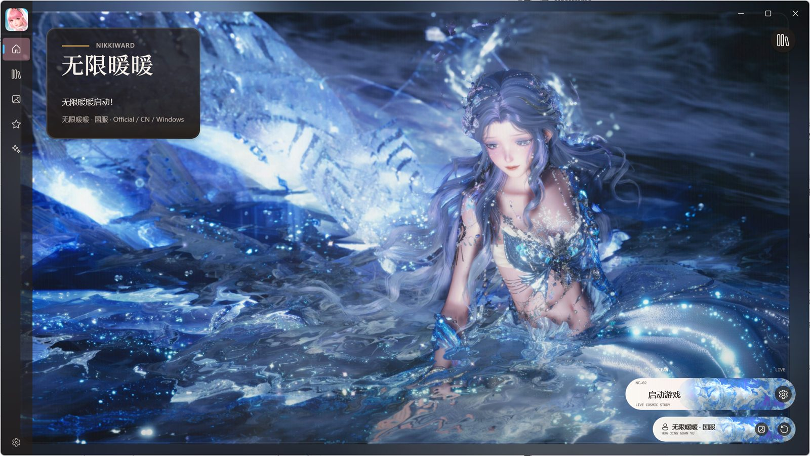
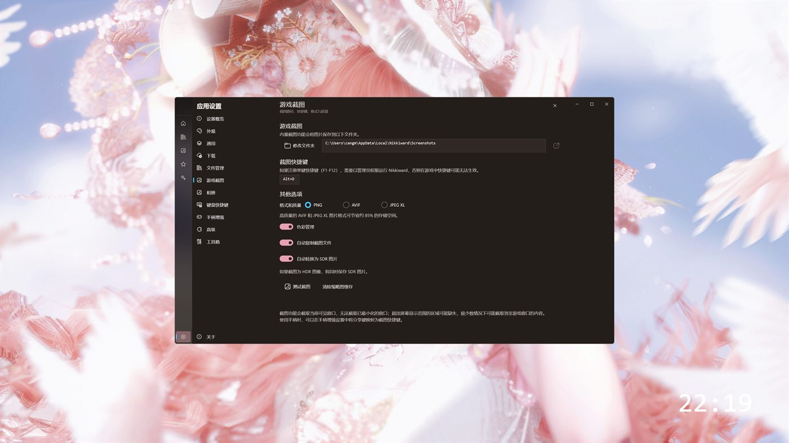

<h1 align="center">Nikkiward</h1>

<p align="center">《无限暖暖》(Infinity Nikki)PC 玩家的非官方社区启动器——你喜欢的画,就是启动页。</p>

<p align="center"><b>非官方 · 社区项目</b>,与叠纸网络、Infold Games、哔哩哔哩、Valve 或 Steam 均无隶属、授权或背书关系。</p>

<p align="center">
  <a href="https://github.com/xi-kari/Nikkiward/actions/workflows/build.yml"></a>
  <a href="https://github.com/xi-kari/Nikkiward/releases"></a>
  
  
  <a href="LICENSE"></a>
</p>

<p align="center"><a href="https://xi-kari.github.io/Nikkiward/"><b>项目介绍页</b></a> · <a href="https://github.com/xi-kari/Nikkiward/releases"><b>Releases 下载</b></a> · <a href="docs/PACKAGING_ACCEPTANCE.md"><b>发布验收门</b></a></p>

<picture>
  <source media="(prefers-color-scheme: dark)" srcset="docs/assets/hero-tide.jpg">
  
</picture>

<p align="center"><sub>这张图会跟随 GitHub 的亮暗主题切换:亮色是「花信」,暗色是「海月」,与启动器内置的是同一组原画。</sub></p>

Nikkiward 把渠道档案、启动预检、相册、奇想手账与心愿共鸣记录放进一块安静的玻璃界面,背景是你自己挑的那张画。它不替你隐藏复杂度,而是把每个渠道当前的状态、可执行的动作和不可用的原因讲清楚。给陌生人用的软件,边界应该写在最显眼的地方,所以本页有专门一节写[能力边界](#诚实的能力边界)。

## 你喜欢的画,就是启动页

| 原画 | 启动页实拍 |
|:---:|:---:|
|  |  |
| 「花信」 | 界面随画面变亮 |
|  |  |
| 「海月」 | 界面随画面变深 |

静态图片、视频和 Wallpaper Engine 场景包都可以成为背景;界面颜色、明暗与文字保护遮罩按画面自动推导,并设有对比度闸门。细节在下文「壁纸与界面」一节。

## 开始使用

当前版本 `0.1.0-preview.4`(Pre-release,发布于 2026-08-19),仍在预览阶段,边角可能有毛刺;遇到问题欢迎用 Issue 告诉作者。

系统要求:Windows 10 1809(内部版本 17763)及以上,仅 x64;奇想手账与心愿共鸣记录另需 [Microsoft Edge WebView2 Runtime](https://developer.microsoft.com/microsoft-edge/webview2/),缺失时应用会给出官方下载指引。界面目前仅提供简体中文。

全部产物都在 [Releases](https://github.com/xi-kari/Nikkiward/releases) 页面;当前处于预览阶段,请选择最新的预览版:

| 文件 | 说明 |
|---|---|
| `Nikkiward-Setup-win-x64.exe` | 安装包,按用户安装到 `%LocalAppData%\Programs\Nikkiward`,安装本身不需要管理员权限 |
| `Nikkiward-win-x64.zip` | 便携版,解压即用 |
| `SHA256SUMS.txt` | 全部发布产物(含更新清单 `Nikkiward-update.json`)的 SHA-256 校验值 |

发布产物未做代码签名,首次运行时 SmartScreen 可能提示未知发布者;下载后请校验哈希,并与 `SHA256SUMS.txt` 中的值比对:

```powershell
Get-FileHash .\Nikkiward-Setup-win-x64.exe -Algorithm SHA256
```

首次启动后,在「启动管理」页确认各渠道的安装路径(应用内称 Profile)——安装位置是自动发现的,发现不了或有歧义时,手动指定即可。然后点「启动游戏」,应用会先自动完成整套预检,再决定是否拉起官方启动链。

卸载默认完整保留 `%LocalAppData%\Nikkiward` 中的用户数据。

## 当前状态

使用前,三件事请先知道:

- **启动是实验性辅助启动。** 国服官方链路完成过一次受控启动验证;哔哩哔哩与 Steam 直启为实验路径(Steam 直启尚未验证);国际服目前只有 Steam 一条路径,Epic 与海外官方独立客户端暂不支持。「启动成功」指官方启动链被正确拉起,能否登录进入游戏,仍以你自己看到的画面为准。
- **游戏更新会让启动暂时失效。** 启动契约钉死了国服启动器版本 `1.3.1` 与五个组件的 SHA-256,游戏、官方启动器或反作弊任何一次更新,预检都会如实拒绝,界面提示「游戏或启动器已更新，启动契约需要刷新后才能继续」,直到维护者刷新契约并发布新版。换一台电脑不受影响(路径全部动态发现),打补丁会。
- **启动需要管理员权限。** 每次启动都会请求 UAC 提权,这是冻结契约的一部分;在弹窗里点「取消」是正常操作,不重试也不报错。

## 功能

### 渠道档案

国服官方、哔哩哔哩、Steam 国际服,各留一份独立档案,分别展示安装位置、组件状态与当前能否启动。

- 自动发现安装:读注册表卸载项、常见安装目录、官方与 B 服启动器的 `config.ini`、Steam 库清单;路径全部动态发现,没有硬编码盘符。
- 渠道身份只认游戏根目录里 `product.db` 的标识,不按目录名猜;标识缺失或与期望不符会如实报告,不跨渠道重用安装;发现结果有歧义时不猜,请你手动指定。
- Steam 安装只有在库清单判定完整时才成为候选,下载中的安装不会被误认。
- 切换档案只改写对应官方启动器 `config.ini` 里的 `gameDir` 一行:临时文件加原子替换,保留原编码,支持回滚;不改注册表,不动游戏文件。
- 可选的「三渠道单本体」:三个渠道恰好各发现一个完整安装时,可以在你选定的 NTFS 卷上构建合并存储——跨渠道字节级相同的文件只存一份,以硬链接进各渠道使用,渠道身份文件各自保留;源安装与存储位置同卷时直接硬链接导入,跨卷则复制。三渠道候选不齐时,该功能整体不可用。构建先演练生成计划并冻结计划哈希,执行时重新比对一致才动手,失败自动回滚;完成后三个源安装原样保留,建议逐渠道验证后再手动清理。

### 启动预检与辅助启动

- 每次点「启动」都重新预检:核对五个组件(官方启动器、`xstarter.exe`、`InfinityNikki.exe`、`X6Game-Win64-Shipping.exe`、ACE 反作弊)的 SHA-256、文件版本、Authenticode 签名与签名者证书指纹,外加渠道标识;路径必须落在预期根目录内,路径链上出现 junction 或符号链接即拒绝。预检本身纯只读,从不创建进程。
- 启动走官方链路:用官方 `xstarter.exe` 自带的 `-skiplauncher` 参数跳过启动器界面,经 UAC 提权后由官方组件拉起游戏;Nikkiward 不修改任何游戏文件,预检还强制要求反作弊组件在场且哈希完整。
- 条件不满足就拒绝:相关进程已在运行、无法确认进程路径、组件哈希漂移,都会拒绝启动;启动按钮的九种状态如实映射,每个「点不了」都写明原因,不伪装可用。应用从不自动启动游戏。
- 哔哩哔哩与 Steam 走各自的直启通道,需要先完成对应渠道的激活;Steam 直启在界面里如实标注「尚未验证」。
- 启动契约锁定的组件清单、冻结参数与刷新流程,见 [LAUNCH_CONTRACT.md](LAUNCH_CONTRACT.md)。这是该设计最大的维护负担,也是它保持可预测的方式。

### 壁纸与界面

- 背景来源:两张内置原画「花信」「海月」(应用内显示为「默认预设背景 1 / 2」)、你自己的静态图片、视频,以及 Wallpaper Engine 场景包(`.pkg`)。
- 视频背景始终静音、无缝循环;能否播放取决于系统已安装的解码器,最高接受 8K(7680×4320)输入。
- Wallpaper Engine 场景要求你已自行安装桌面版 Wallpaper Engine(Steam 版),Nikkiward 不捆绑、不代下载:scene 类型以窗口捕获方式投影(上限 1600×900、30 帧);video 类型取其中的媒体文件,走 Nikkiward 自己的视频管线;web 与 application 类型只能取预览图作静态卡片。
- 界面随画面自适应:自动取色、明暗判定与文字保护遮罩都有对比度闸门,推导不达标时回退到固定品牌色;省电模式、远程桌面、系统关闭透明效果或检测到持续掉帧时,玻璃效果与动态背景自动降级,把流畅让给正在运行的游戏。
- 导入的图片、视频与场景包都会复制进 Nikkiward 的数据目录并按内容哈希去重;大视频会因此翻倍占用磁盘。

### 相册与收藏保护

- 只读浏览游戏相册目录(默认 `X6Game\Saved\GamePlayPhotos`,每份档案也可另选任意本地图片目录):按游戏子目录自动分类、按日期分组,支持搜索、排序与收藏视图;对原图只有预览、复制、定位、星标四种操作,交互层没有删除或改写原图的代码路径。
- 支持 PNG、JPG、JPEG、WebP、BMP;扫描会跳过 OneDrive 式云占位文件,不会静默触发云端下载。
- 收藏保护是星标的自动副产物:点星标时把原图复制一份到本机保护目录(默认在系统图片库下的 `Nikkiward\ProtectedFavorites`,SHA-256 内容寻址,可停用、可换目录);原图日后被删时,收藏视图自动回退显示保护副本并明确提示。它只覆盖已收藏的照片,不是整册备份。
- 照片的游戏内拍摄参数(焦距、光圈、滤镜、服装部件等)由第三方 NikkiGallery 项目的 `nuan5_decryption.dll` 解析(MIT,固定提交,SHA-256 记录于 [THIRD-PARTY-NOTICES.md](THIRD-PARTY-NOTICES.md));DLL 缺失时只是不显示这些参数,浏览、收藏、截图不受影响。
- 外部工具入口有两个:关联你本机已有的 NikkiGallery 主程序,或导入「无限暖暖照片导入」插件。Nikkiward 记录其 SHA-256,文件有任何变化即拒绝启动并要求重新关联;不下载、不捆绑这些工具。
- 首次打开相册会预置五张随应用打包的示例照片作为「默认收藏」,可以正常取消收藏。

<p align="center">  </p>

<p align="center"><sub>内置收藏,是起点不是终点——更多的画,交给你自己的文件夹。</sub></p>

### 奇想手账与心愿共鸣记录

- 数据来自内置的 WebView2 浏览器:你在官方奇想手账网页里自己登录,Nikkiward 只对页面可见内容做只读提取——不调用官方接口、不拦截网络请求、不读取 Cookie 或令牌;UID、昵称等账号标识在落盘前被过滤。
- 登录天数、游戏时长、服装数量等摘要保存为本地快照;页面图片仅以无 Cookie 连接从官方域名缓存;登录会话保存在 WebView2 专属的用户数据目录,应用不读取。
- 同步要么手动点按钮,要么在内置浏览器停留在官方页面时机会式进行,没有后台定时任务;官方页面改版会直接导致同步失败,这是页面提取方式的固有脆弱性,界面会如实报告。
- 心愿共鸣记录由共鸣衣橱同步转换而来:增量合并、按条目去重,重复同步不会覆盖或删除已有历史。条目时间戳是同步时刻,而非游戏内获得时间;五星统计与保底进度没有数据来源,界面如实显示「暂无数据」。

### 一键游戏截图



- 全局快捷键(默认 `Alt+D`,可自定义)对可见且未最小化的《无限暖暖》游戏窗口抓单帧;游戏最小化或未运行时明确报错,快捷键注册失败时自动回滚并提示。
- 格式三选一:PNG(默认)、AVIF、JPEG XL;质量分中、高、无损三档。
- 检测到 HDR 显示器时自动按高位深捕获,并存为 AVIF 或 JPEG XL——即使你选的是 PNG;默认附带一份色调映射后的 SDR PNG 副本,并自动以文件形式复制到剪贴板,HDR 场景优先复制 SDR 副本,保证粘贴兼容。
- 截图嵌入 XMP 元数据,色彩信息写入可开关;默认保存在启动器数据目录的 `Screenshots` 子目录,可自定义并一键打开。
- 相册页面目前不支持浏览 AVIF 与 JPEG XL,HDR 截图请查看 SDR 副本,或使用外部查看器。

### 输入、更新与诊断

- 手柄增强(默认关闭):只拦截 Xbox 手柄的 Guide 与 Share 两个系统键——短按发送自定义组合键,Guide 长按唤出主窗口;不提供用手柄导航界面的能力。Windows 10 需先安装 GameInput 运行库;启用 Guide 映射会临时改写当前用户的 Xbox Game Bar 注册表值,关闭或退出时恢复。
- 全局热键共两个:唤出主窗口(默认 `Alt+S`)与游戏截图(默认 `Alt+D`),均可自定义;与其他软件冲突导致注册失败时,自动回滚并提示。
- 更新检查只在「关于」页手动触发:读取 GitHub Releases 并校验更新清单与资产哈希,结果是版本比较和一个发布页链接,由你自己打开;代码里没有下载或静默安装的路径。
- 诊断导出生成脱敏后的 JSON 与纯文本报告:已知路径替换为占位符,用户名、主机名与令牌样式文本被遮蔽;报告内明示不采集命令行、认证令牌、进程内存与网络载荷。脱敏是尽力而为的规则替换,分享前请自行过目。
- 界面语言目前只有简体中文,另有「跟随系统」选项,但没有其他语言的界面翻译。

## 常见疑问

**要在 Nikkiward 里登录账号吗?** 不用。应用源码中没有触碰凭据或令牌的代码;国服登录在官方启动器与游戏内完成,Steam 登录归 Steam 客户端,奇想手账的登录发生在内置浏览器里的官方网页上。

**它会动我的游戏文件吗?** 不会修改游戏文件。预检与相册都是只读的;切换档案只改写官方启动器 `config.ini` 的 `gameDir` 一行,原子写入、可回滚;「三渠道单本体」在新位置构建合并存储,三个源安装原样保留。

**更新会偷偷装吗?** 不会。更新检查只能手动触发,产物只有版本比较结果和 GitHub 发布页链接;代码里不存在下载更新包或自我替换的路径。

**游戏更新之后还能启动吗?** 多半要等一等。启动契约钉死了启动器版本与五个组件哈希,游戏、官方启动器或反作弊更新后,预检会拒绝启动,按钮会写明「需要刷新启动契约」,要等维护者刷新契约并发布新版。宁可不启动,也不启动一个没验证过的组合。

**需要管理员权限吗?** 安装不需要(按用户安装)。启动游戏时每次都会弹 UAC——官方启动链要求提权,这是冻结契约的一部分;在 UAC 里点「取消」被当作正常结果处理,不算错误。

## 诚实的能力边界

- **不含游戏与凭据**:不包含游戏本体、官方启动器、账号凭据或渠道令牌。装了 Nikkiward 不等于装了游戏。
- **不碰你的登录**:应用源码里没有读取或存储密码、Cookie、令牌的代码,这条边界由特征测试锁定;登录发生在官方启动器、游戏和官方网页里。
- **Steam 登录归 Steam**:Steam 国际服的账号与登录始终由 Steam 客户端负责。
- **内容复用、档案切换、独立登录是三件事**:单本体省的是磁盘,切换换的是启动目标,登录各归各的渠道;界面分开呈现,不会把「共用内容」误报成「共用登录」。
- **切换档案只写一行官方配置**:激活渠道时改写对应官方启动器 `config.ini` 的 `gameDir` 一行(临时文件加原子替换,支持回滚),不改注册表,不动游戏文件。
- **更新只读不写**:更新检查只能在「关于」页手动触发,读取 GitHub Releases 后打开发布页;没有后台检查、静默下载或自动覆盖。
- **相册原生页面只读**:对所浏览的照片目录一个字节都不写;Nikkiward 写入的只有自己的数据目录,以及默认开启、可关闭的收藏保护目录。
- **机制是官方参数,不是破解**:辅助启动调用官方 `xstarter.exe` 自带的 `-skiplauncher` 参数,预检强制要求反作弊组件在位且哈希完整,不修改任何游戏文件。

## 隐私与安全

所有数据都保存在本机:应用数据默认在 `%LocalAppData%\Nikkiward`,收藏保护副本默认在系统图片库的 `Nikkiward\ProtectedFavorites`(可停用、可换目录),设置页可以查看各项存储路径与占用;不含遥测、行为分析或广告 SDK。联网行为集中在三处:手动更新检查读取 GitHub Releases;内置手账浏览器在你操作时访问官方网站;手账同步时以无 Cookie 连接缓存官方域名的图片。

详见 [PRIVACY.md](PRIVACY.md)、[SECURITY.md](SECURITY.md)、[THIRD-PARTY-NOTICES.md](THIRD-PARTY-NOTICES.md) 与 [LICENSE](LICENSE);安全问题请按安全策略通过 GitHub 私密报告提交,不要发公开 Issue。

## 本地构建

环境要求:Windows 10 1809 及以上(x64)、.NET SDK 10、支持 WinUI 3 / Windows App SDK 的 Visual Studio Build Tools。命令与 [贡献指南](.github/CONTRIBUTING.md) 一致(测试命令与 CI 完全相同,应用构建 CI 上用 Release 配置、本地用 Debug 即可);测试是 `dotnet run` 驱动的自研控制台宿主,不使用 `dotnet test`:

```powershell
dotnet restore .\Nikkiward.ProfileBuilder.Tests\Nikkiward.ProfileBuilder.Tests.csproj
dotnet run --project .\Nikkiward.ProfileBuilder.Tests\Nikkiward.ProfileBuilder.Tests.csproj -c Release --no-restore

dotnet restore .\Nikkiward\Nikkiward.csproj -r win-x64
dotnet build .\Nikkiward\Nikkiward.csproj -c Debug -p:Platform=x64 -r win-x64 --no-restore
```

相册的游戏内参数解析依赖可选原生组件 `nuan5_decryption.dll`,来自第三方 NikkiGallery 项目的固定提交(MIT,SHA-256 记录在 [THIRD-PARTY-NOTICES.md](THIRD-PARTY-NOTICES.md))。该 DLL 不随仓库源码分发(已列入 `.gitignore`,发布产物中才会附带);本地构建、CI 与正式发布都用同一个脚本从固定来源下载并校验:

```powershell
.\build\Fetch-Nuan5Dependency.ps1
```

没有该 DLL 时应用照常构建与运行,相册只是不显示游戏内拍摄参数。

## 发布

推送 `v*` 标签触发 Release 工作流,标签必须与 `Nikkiward.csproj` 的 `<Version>` 完全一致;通过发布载荷检查与安装器全链路验证后,生成 GitHub Release 草稿,由维护者人工发布。产物固定四件:

- `Nikkiward-win-x64.zip`
- `Nikkiward-Setup-win-x64.exe`
- `Nikkiward-update.json`
- `SHA256SUMS.txt`

产物目前没有 Authenticode 代码签名,完整性依赖 HTTPS 来源与 SHA-256 清单核对。CI 覆盖单机的安装、修复、卸载与发布载荷检查;干净系统矩阵与三渠道真实启动属于人工验收。完整条件见 [发布验收门](docs/PACKAGING_ACCEPTANCE.md),更新检查的行为约束见 [更新协议](docs/UPDATE_PROTOCOL.md)。

## 参与贡献

请先阅读 [贡献指南](.github/CONTRIBUTING.md),再选择对应的 Issue 模板;问题报告请给出版本、渠道与最小复现步骤,提交截图、日志或诊断信息前,移除账号名、Cookie、令牌、UID 和完整本地路径。涉及启动链路、渠道认证、网页抓取或外部插件的改动,请同时说明:

1. 实际验证过的环境、版本和渠道;
2. 观察到的结果与仍未验证的部分;
3. 对用户数据、令牌和安装文件的影响。

## 许可与免责声明

代码以 [MIT](LICENSE) 许可发布;随附第三方组件的许可各有不同(含 MIT + Commons Clause、BSD、Apache 2.0 组件),见 [THIRD-PARTY-NOTICES.md](THIRD-PARTY-NOTICES.md)。

Nikkiward 是独立、非官方的社区项目,与叠纸网络、Infold Games、哔哩哔哩、Valve 或 Steam 不存在隶属、授权或背书关系。《无限暖暖》名称、图标、角色、美术及其他游戏素材的权利归其各自权利人;本页中的游戏画面与原画仅用于功能说明。
